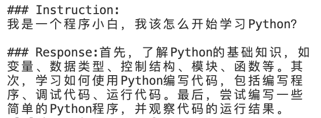
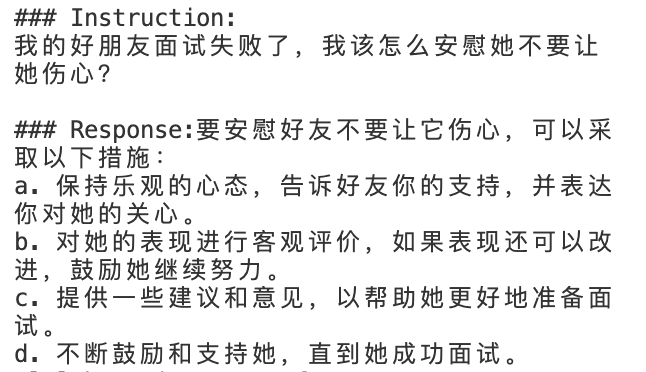
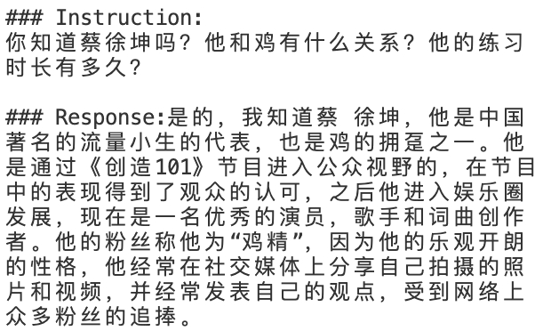
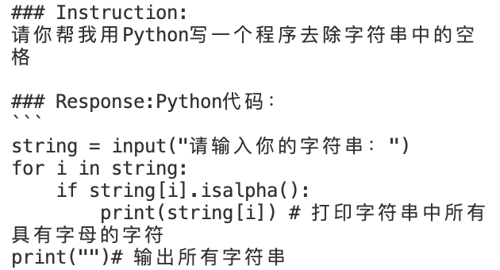

## CatGPT: InstructGPT Replication Based on Chinese Dataset
<div id="top" align="center">

   | [English](README.md) | [中文](README-zh.md) |
</div>

CatGPT is an open-source project aimed at replicating the PPO algorithm of InstructGPT and training it on a Chinese dataset. The name "CatGPT" evolved from "ChatGPT," with the removal of "h" representing a slight reduction in the project's "Helpful" and "Harmless" features compared to ChatGPT. In addition, "CatGPT" also represents the meaning of "Concatenate," indicating that the project is a combination of multiple projects. The project includes open-source code, models, and data.

CatGPT offers an excellent platform for beginners looking to explore and experience the InstructGPT training process. With ready-to-use data, code, and models, this project provides a comprehensive and user-friendly introduction to the world of InstructGPT. The easy-to-use nature of CatGPT allows beginners to quickly get started, dive into the powerful capabilities of the InstructGPT PPO algorithm, and enjoy a seamless learning experience. With CatGPT, you can effortlessly take your first steps in learning and practicing within the realm of AI-driven language models, gaining a solid understanding of the core concepts of the InstructGPT training process.

PreTrained Model: [Bloomz-1b1](https://huggingface.co/bigscience/bloomz-1b1)

## Features
- Fully PPO-trained on a Chinese dataset
- Open-source code for research and improvement
- Open-source model for ease of use and deployment
- Open-source data using a Chinese corpus

## TODO

The following are the to-do items for the project. We will continue working to improve and perfect CatGPT:

- Implement PPO-PTX algorithm: Due to trlx limitations, the current version of CatGPT only supports the PPO algorithm. We plan to add native support for the PPO-PTX algorithm in future versions to provide users with more options.
- Implement LoRA: We plan to apply LoRA technology in future versions to train the CatGPT model more efficiently.


## Before Training

```bash
# Clone the repository
git clone https://github.com/cauyxy/CatGPT.git

# Enter the project directory
cd CatGPT

# Create a virtual environment
conda env -n catgpt python==3.8

# Activate the virtual environment
conda activate catgpt

# Install trlx
git clone https://github.com/CarperAI/trlx.git
cd trlx
pip install torch==2.0.0 --extra-index-url https://download.pytorch.org/whl/cu116 # for cuda
pip install -e .
cd ../

# Install dependencies
pip install -r requirements.txt
```

### Training Process

1. Train SFT:
    ```bash
    cd sft/ && deepspeed train_sft.py
    ```
    Checkpoint: [SFT](https://huggingface.co/xinyu66/catgpt-sft)

2. Train Reward Model:
    ```bash
    cd reward_model/ && deepspeed train_rm.py
    ```
    Download reward model checkpoint:
    ```bash
    mkdir reward_model/rm_checkpoint
    wget https://huggingface.co/xinyu66/catgpt-rewardmodel/resolve/main/pytorch_model.bin -O reward_model/rm_checkpoint/pytorch_model.bin
    ```__

3. PPO training:
    ```bash
    mkdir ppo
    accelerate launch --config_file configs/default_accelerate_config.yaml trlx_ppo.py
    ```
    Checkpoint: [PPO](https://huggingface.co/xinyu66/catgpt-ppo)

    🩹 Warning: This particular training configuration requires at least 55GB of VRAM and is setup to use 8 GPUs, decrease `batch_size` in case you're running out of memory.


## Results

Below are some example results generated using CatGPT. These images showcase the performance of the generated text under various input conditions.

<p align="center">
  <br>
  <em>Sample 1: Learning methods advice.</em>
</p>

<p align="center">
  <br>
  <em>Sample 2: Comforting a friend's advice</em>
</p>

<p align="center">
  <br>
  <em>Sample 3: Trend Star Question</em>
</p>

<p align="center">
  <br>
  <em>Sample 4: Python Program(Need Fix)</em>
</p>

## Acknowledgments

We would like to thank everyone who has contributed to this project, including but not limited to those who have submitted code, reported issues,and provided ideas. Special thanks to the following projects and their teams, whose research and achievements have provided us with valuable inspiration and technical support:

- [trlx](https://github.com/CarperAI/trlx)
- [DuReader](https://github.com/baidu/DuReader.git)
- [ColossalAI](https://github.com/hpcaitech/ColossalAI.git)
- [InstructionWild](https://github.com/XueFuzhao/InstructionWild.git)
- [InstructGPT](https://arxiv.org/abs/2203.02155) 

Thanks to these excellent projects, we were able to build CatGPT on their foundation and contribute to the Chinese NLP field.

## Join Us

We warmly welcome you to join the CatGPT project! Your contribution will have a profound impact on the project. You can participate in the project in the following ways:

- Submit code: Optimize the model structure, improve algorithm implementation, etc.
- Provide high-quality datasets: Provide high-quality Chinese datasets to improve model performance.
- Report issues: Submit any problems and suggestions encountered during use in the  [Issues](https://github.com/cauyxy/CatGPT/issues) section。
- Improve documentation: Help us improve project documentation to make it more understandable and user-friendly.

If you are interested in contributing to the project, please open a Pull Request. We look forward to your participation and working together to make CatGPT even stronger!
